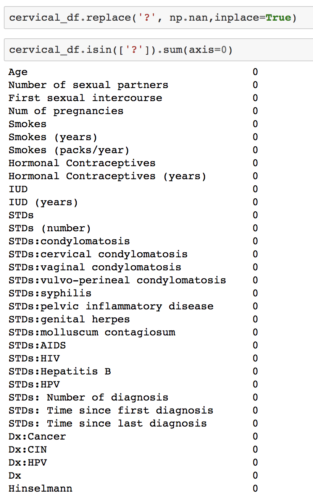
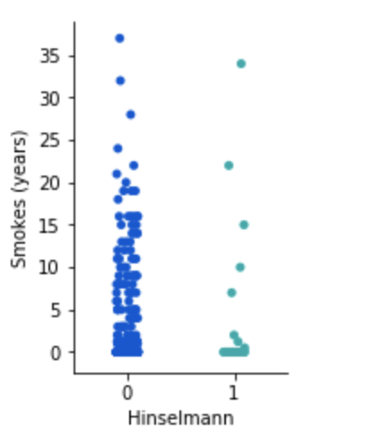

> Report

Evidence Based Medicine- Cervical cancer study

Problem Statement:

Goal of this project is to develop a predictive model to identify top
causes of cervical cancer among women based on their medical history as
well as lifestyle. Key cause of cervical cancer can be identified based
on Machine learning algorithm. For this problem, I am using python and
spark machine learning libraries.

Data source:

Cervical data is sourced from UCI website.

<https://archive.ics.uci.edu/ml/datasets/Cervical+cancer+%28Risk+Factors%29#>

Data Description:

The dataset was collected at 'Hospital Universities de Caracas' in
Caracas, Venezuela. The dataset comprises demographic information,
habits, and historic medical records of 858 patients. Several patients
decided not to answer some of the questions because of privacy concerns
(missing values)

Fields Name

(int) Age \
(int) Number of sexual partners \
(int) First sexual intercourse (age) \
(int) Num of pregnancies \
(bool) Smokes \
(bool) Smokes (years) \
(bool) Smokes (packs/year) \
(bool) Hormonal Contraceptives \
(int) Hormonal Contraceptives (years) \
(bool) IUD \
(int) IUD (years) \
(bool) STDs \
(int) STDs (number) \
(bool) STDs:condylomatosis \
(bool) STDs:cervical condylomatosis \
(bool) STDs:vaginal condylomatosis \
(bool) STDs:vulvo-perineal condylomatosis \
(bool) STDs:syphilis \
(bool) STDs:pelvic inflammatory disease \
(bool) STDs:genital herpes \
(bool) STDs:molluscum contagiosum \
(bool) STDs:AIDS \
(bool) STDs:HIV \
(bool) STDs:Hepatitis B \
(bool) STDs:HPV \
(int) STDs: Number of diagnosis \
(int) STDs: Time since first diagnosis \
(int) STDs: Time since last diagnosis \
(bool) Dx:Cancer \
(bool) Dx:CIN \
(bool) Dx:HPV \
(bool) Dx \
(bool) Hinselmann: target variable \
(bool) Schiller: target variable \
(bool) Cytology: target variable \
(bool) Biopsy: target variable

Technology used:

a.  Python and Pyspark Machine learning library is used for predictive
    analysis.

b.  Matplotlip is used for ploting data graph

c.  Pandas and numpy for data transformation.

Code and steps

a.  Data Analysis and transformations

Load the data into python DataFrame and check if data set is a balanced
dataset.

{width="6.788194444444445in"
height="4.509259623797026in"}

{width="6.5in" height="2.3425929571303588in"}

For each column there is only 35 rows for Hinselmann=1 and 823 records
for value 0. This dataset is unbalanced need to be balanced in order to
make correct prediction and determine important features.

This can be taken care once all the data is cleaned and transformed.

Checking blank data (in this case it is ‘?’) in the data set and then
replace it with Nulls.

{width="4.851851487314086in"
height="5.2866655730533685in"}

Replace “?” with NAN in the data set.

{width="4.064815179352581in"
height="6.43459208223972in"}

Replace null value with 0s and 1’s to Boolean features using back fill
and forward fill method. Also we will replace all integer column with
their respective mean value.

{width="6.5in" height="6.2037040682414695in"}

{width="6.5in" height="1.4048611111111111in"}

Check if there is any null value left in the column to make sure all the
columns are remediated.

{width="3.638888888888889in"
height="4.854518810148732in"}

{width="6.5in" height="3.930340113735783in"}

Column 'STDs: Time since first diagnosis' and 'STDs: Time since last
diagnosis' has large number of null. Both the column has little
importance in predicting the true value of target column and hence can
be dropped.

{width="5.25in"
height="6.073397856517936in"}

{width="6.5in"
height="3.8402777777777777in"}

Drop rest of the target column as well since it is be not used in the
project.

{width="6.5in"
height="3.7291666666666665in"}

a.  Plot graphs for further data analysis

Plotting Scatter Matrix to find co-relation between different features
and predictor.

{width="6.5in"
height="0.6819444444444445in"}{width="6.5in"
height="6.331944444444445in"}

Plotting violin plot for age and number of sexual partners.

{width="5.740740376202974in"
height="4.882695756780403in"}{width="5.77948709536308in"
height="3.861111111111111in"}

Most of the women in the data set are age 20-40 Years old and data may
be helpful in in determining cause of cancer among women between age
20-40.

{width="5.701956474190726in"
height="3.9074070428696412in"}

-   

{width="0.4027777777777778in"
height="9.722222222222222e-2in"}{width="5.944444444444445in"
height="3.329142607174103in"}

Based on violin graph most of the women with cervical cancer had 2 or
more pregnancy.

{width="5.513888888888889in"
height="1.3611111111111112in"}

{width="6.5in" height="1.13125in"}

{width="4.972222222222222in"
height="1.2777777777777777in"}{width="2.110936132983377in"
height="2.8041666666666667in"}{width="1.8981485126859143in"
height="2.759012467191601in"}
{width="2.25in"
height="2.564583333333333in"}

Based on above grid it is hard to predict if Smoke years, Hormonal
Contraceptive and IUD are important feature. ( This may be due to
unbalanced dataset)

Checking relation between number of sexual partners and age and number
of pregnancies.

{width="6.5in"
height="0.17083333333333334in"}{width="6.5in"
height="2.545138888888889in"}

{width="6.5in" height="2.8875in"}

Use transformed data to predict target variable using unbalanced data

We need to first find correlation between feature and predictor. This
will give hint on important feature and we can compare it with the
features importance list for best prediction algorithm

{width="6.5in"
height="1.0777777777777777in"}

Correlation :

{width="6.5in"
height="3.9256944444444444in"}

Based on correlation score above Dx:HPV, Dx:Cancer can be leading case
for cervical cancer. Let see if we get same feature with predictive
model as well.

Creating VectorAssembler to join features and predictor.

{width="6.888990594925635in"
height="1.6111111111111112in"}

Create train and test data set.

{width="6.5in" height="0.75625in"}

Apply Linear regression on dataset.

{width="6.5in"
height="1.8981485126859143in"}

Based on training data AUC is 72%, i.e only 72% of predicted value is
accurate.

{width="6.511007217847769in"
height="5.351851487314086in"}

Plotting ROC curve and Precision curve

{width="6.5in"
height="3.8006944444444444in"}

Both ROC and Recall curve has jaggred line showing that algorithm is not
working as expected.

Testing the model using test dataset. Higher rawPrediction define
confidence in predictive value. Higher the rewPrediction value greater
the confidence level on prediction value.

{width="6.5in"
height="3.0092596237970253in"}

For unbalanced data, 72% of accuracy is not bad. Let see if we ca
perform better with other algorithm.

BinaryClassification

{width="6.5in" height="1.04375in"}

Roc is less than what was achieved with Linear regression. Now checking
Decision Tree algorithim.

{width="6.5in"
height="3.1173611111111112in"}

Decision tree is also underperforming as compare to Linear regression.
Since Random forest perform better than decision tree normally, checking
with Random Forest.

{width="6.5in" height="3.223611111111111in"}

To overcome the issue of imbalanced data, we will re-sample the data
using SMOTE function and then try Linear Regression and Random forest
again on balanced data set.

Create a Feature dataset with all the features to be used and label
dataframe with predictor value.

{width="6.5in"
height="2.2243055555555555in"}

Split data in training and test dataset and further split training
dataset to training and validation dataset.

{width="6.5in"
height="0.5472222222222223in"}

{width="6.5in"
height="0.45208333333333334in"}

Applying SMOTE function to re-sample the data.

{width="6.5in"
height="0.9923611111111111in"}{width="6.5in"
height="0.7395833333333334in"}

After applying SMOTE function, we have a balanced data. Now applying
Logistic regression on balanced data.

{width="6.5in" height="2.464583333333333in"}

Accuracy is still low, actually lower than Linear regression on
unbalanced data. Now apply random forest since it usually over perform
than any other algorithm.

{width="6.5in"
height="3.8222222222222224in"}

Random algorithm is performing exceptionally well with balanced data.
Test data accuracy is 96.5% .

Now we can determine the feature importance (list most important and
relevant feature risk which may cause cervical cancer)

{width="6.5in"
height="0.7875in"}{width="4.527777777777778in"
height="5.838989501312336in"}

Based on above list Number of pregnancies , sexual partners and years of
hormonal Contraceptives has the highest importance.

{width="6.814583333333333in"
height="3.611111111111111in"}

We can validate this with studies by Cancer Center.

{width="6.248013998250219in"
height="3.564815179352581in"}

Source of above screenshot :
<https://www.cancercenter.com/cervical-cancer/risk-factors/>

Conclusion:

Evidence based Medicine using Machine learning can be used by care-giver
to identify patients who can be benefitted by early intervention. This
is not just for cervical cancer but also for any other health issue like
diabetes, breast cancer etc. Clinician and care giver can use
EBM-machine learning methods for providing better care to patient in
real-time.

Early intervention and detection can help women who are more susceptible
to cervical cancer to get better and on-time treatment. This could
prevent death due to cervical cancel which is one of the highest
mortality rate amount women. The feature identified above can be used by
caregiver to identify women more susceptible to get pre-cervical cancer.

Sources:

<https://www.cancercenter.com/cervical-cancer/risk-factors/>

<https://archive.ics.uci.edu/ml/datasets/Cervical+cancer+%28Risk+Factors%29#>

YouTube Link :

2 min: <https://youtu.be/fMLLle3IzAg>

15 min: <https://youtu.be/6NioyLelpMo>
